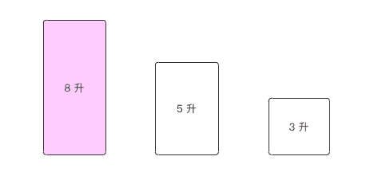

# thinking-1

### 来自字节跳动(bytedance)面试题

### 题目：给你一个装满水的 8 升满壶和两个分别是 5 升、3 升的空壶，请想个优雅的办法，使得其中一个水壶恰好装 4 升水，每一步的操作只能是倒空或倒满。

 
理解了这个题目的意思之后，我们的第一个方法肯定就是使用强大的脑力来进行暴力破解法，瓶子里的水在我们的脑子里颠三倒四，但是脑子有可能没那么清晰，想了几步之后就开始出现记忆错乱，然后就不得不开始慢慢重播。 甚至到最后好不容易搞定了，但是怎么走过来的步骤又给忘记的一干二净 —— 智商好像受到了点小小的侮辱！

这道题其实有一道非常科学的解决方法 —— 广度遍历，我们将三个瓶子的状态标示为一个数。

**8 0 0**

然后开始拓展这个数的所有可能的状态，第一步这个数可以变为，括号里的数是上一步的数字

**3 5 0（8 0 0） 、 5 0 3（8 0 0）**

然后继续拓展第二步所有可能的状态，**并且不得和之前的状态出现重复（这叫剪枝）**

**0 5 3（3 5 0）、3 2 3（3 5 0）、5 3 0（5 0 3）**

继续第三步

**6 2 0（3 2 3）、2 3 3（5 3 0）**

我们发现状态变少了，这是怎么回事呢？这是因为剪枝约束 —— 不得出现和之前重复的状态，就好比下象棋，如果我不动我还能活，但是必须动就会被将死的感觉一样。

继续第四步

**6 0 2（6 2 0）、2 5 1（2 3 3）**

继续第五步，怎么还没出现 4 这个数字呢，好着急啊！

**1 5 2（6 0 2）、7 0 1（2 5 1）**

继续第六步

**1 4 3（1 5 2）**

总算搞定了，这就是算法的**停止条件**，出现第一个数字 4。所以最终的路径就是

**1 4 3 <-- 1 5 2 <-- 6 0 2 <-- 6 2 0 <-- 3 2 3 <-- 3 5 0 <-- 8 0 0**